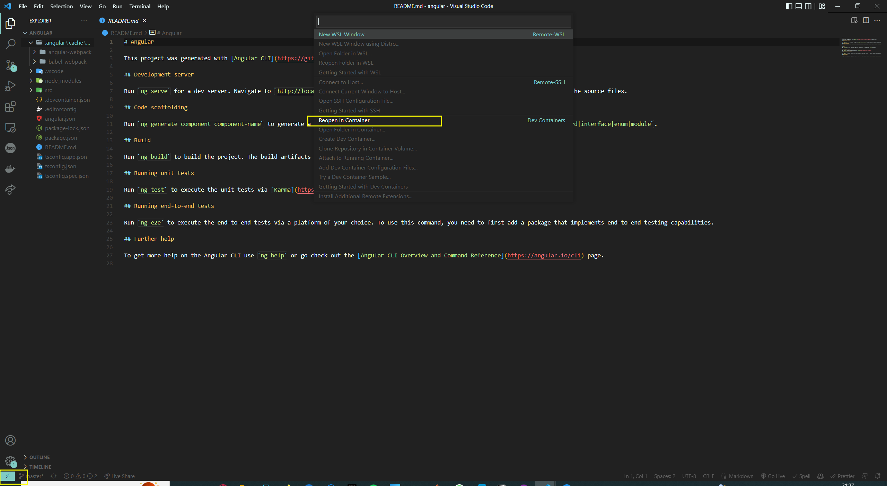
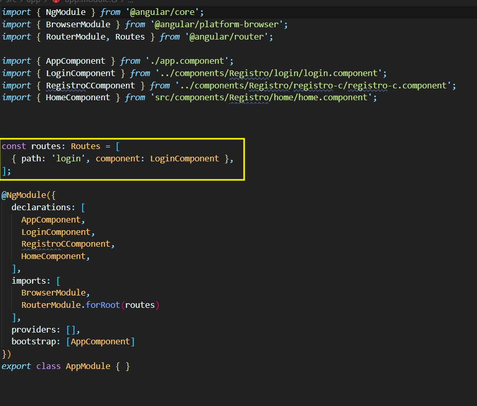

<h1>Producción</h1>
Levantar el proyecto  docker-compose.yml
```
docker-compose up -d 
```
<b>Si es la primera vez que arrancas la aplicacion descomenta la función de crear tablas del archivo app.py</b>
<h1>Desarrollo</h1>
Necesario utilizar dev-container del VSCode para levantar el proyecto.
En caso de trabajar con el server, abriremos esa  carpeta en el VSCode, o, en caso de trabajar con angular, abriremos esa carpeta en el VSCode. Una vez abierta la carpeta en el VSCode nos aparecerá un botón en la parte inferior derecha que dice: "Reopen in container". Hacemos click y se nos abrirá el proyecto en el dev-container.



<h2>Estructura del proyecto</h2>
Aqui encontramos dos carpetas principales:
<h3>Server</h3>
Es la API de Python, y se encarga de hacer las consultas a la base de datos y devolver los datos en formato JSON.
<br>
<br>
<h4>Estructura:</h4>
<b>Repository</b>: Aquí encontraremos los archivos que se encargan de hacer las consultas a la base de datos.
<br>
<b>Services</b>: Aquí encontraremos los archivos que se encargan de hacer las consultas a los repositorios.
<br>
<b>Controller</b>: Aquí encontraremos los archivos que se encargan de hacer las consultas a los servicios.
<br>
<b>app.py</b>: Archivo principal de la API.
<br>
<b>Model</b>: Aquí encontraremos los archivos que se encargan de los modelos de la base de datos (no dejan de ser clases).
<br>
<b>Utils</b>: Aquí encontraremos los archivos que hemos utilizado para crear los <b> tokens JWT </b> para las sesiones. Estos token sirven para autenticar usuarios en la aplicación web.
<br>
<b>config.py</b>: Archivo donde se encuentran las variables de entorno de la API.
<br>
<b>requirements.txt</b>: Archivo donde se encuentran las librerías que se han utilizado en el proyecto.
<br>
<b>docker-compose.yml</b>: Archivo donde se encuentran las configuraciones de los contenedores de la API.
<br>
<b>Dockerfile</b>: Archivo donde se encuentran las configuraciones de los contenedores de la API.
<br>

<h3>Angular</h3>
Es la aplicación de angular que se encarga de consumir los datos de la API y mostrarlos en una aplicación web con ficheros estáticos:  <b>CSS, HTML y JavaScript. </b>
<br>
<br>
<b>Aquí en el proyecto nos fijamos solo en la carpeta de src, </b> ya que es donde se encuentra toda la lógica de la aplicacion y el HTML.
<br>
<br>
<h4>Estructura:</h4>
<b>Assets</b>: Carpeta donde irán las imágenes y otros ficheros.
<br>
<b>Components</b>: Carpeta donde irán los componentes (trozos de HTML)  de angular. Dentro, hay subcarpetas con las url de la aplicación web, y, a su vez, subcarpetas con los componentes de cada url.
<br>
<b>Models</b>: Carpeta donde irán los modelos de los datos que se van a utilizar en la aplicación. Son clases que contienen los datos de la base de datos.
<br>
<b>Services</b>: Carpeta donde irán los servicios que se van a utilizar en la aplicación. No dejan de ser un conjunto de funciones (utilidades) que se encargan de hacer las consultas a la API, y devolver los datos que se van a utilizar en los componentes de angular, ya que es accesible desde cualquier sitio de la aplicación.
<br>

<h4>Componentes:</h4>
Aqui encontramos un archivo HTML que es el que se va a mostrar en la aplicacion web, un archivo .ts que no deja de ser JavaScript, y los estilos usados.
<br>
<h4>Urls</h4>
Para esto debemos mirar el archivo app.module.ts que esta dentro de src/app

Recordemos que el componentes ahi que refrerenciar <b>&ltrouter-outlet&gt &lt/router-outlet&gt</b> es donde se van a mostrar los componentes de angular.
<br>
<h3>Lista de componentes:</h3>
<h4>Not-found:</h4> Componente que muestra la pagina de error 404.
<br>
<h4>Productos:</h4>
<b>Add-product</b>: Componente que muestra el formulario para añadir un producto.
<br>
<b>Update-product</b>: Componente que muestra el formulario para actualizar un producto.
<br>
<b>List-product</b>: Componente que muestra la lista de productos.
<br>
<b>Navbar</b>: Componente que muestra la barra de navegación.
<br>
<b>Shop:</b> Componente que muestra la tienda.
<br>
<br>
<h4>Registro:</h4>
<b>Home</b>: Componente que muestra el home de la página.
<br>
<b>Registro-c</b>: Componente que muestra el formulario de registro.
<br>
<b>Login</b>: Componente que muestra el formulario de login.


